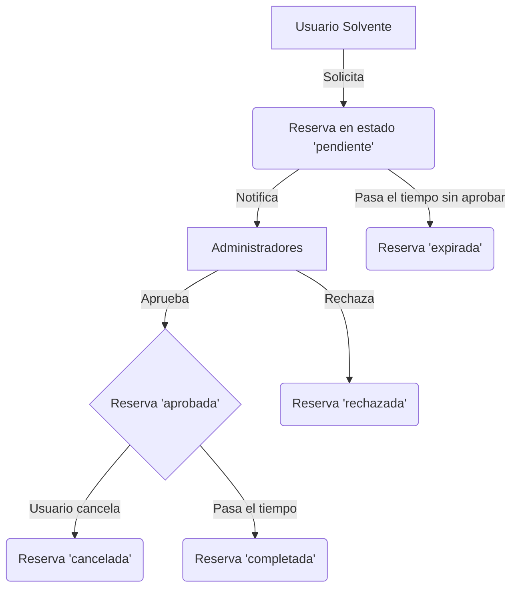

# 04 - Sistema de Reservas y Disponibilidad

> **Propósito**: Este documento detalla el funcionamiento del sistema de reservas, desde la creación de una solicitud hasta la consulta de disponibilidad de áreas. Consolida la información de `docs/reservation-system.md` y las reglas de negocio de `specs/cpu_reglamento_negocio.md`.

---

## 1. Lógica de Negocio y Reglas Clave

El sistema de reservas se rige por las siguientes reglas, extraídas del reglamento de la CPU y la configuración del sistema:

- **¿Quién puede reservar?**: Usuarios con rol `profesor`, `estudiante` o `invitado` que tengan un estado (`status`) de `solvente`.
- **¿Qué se puede reservar?**: Solo `Areas` que tengan el atributo `is_reservable = true`.
- **Aprobación Requerida**: Toda reserva nace con estado `pendiente` y debe ser aprobada por un `administrador` para ser confirmada.
- **Sistema Anti-colisión**: Antes de crear o aprobar una reserva, el sistema verifica que el horario solicitado no se solape con:
  - Otras reservas ya `aprobadas`.
  - Horarios de `AcademySchedules` (clases de academias).
  - Horarios de cierre del área (`AreaSchedules`).
- **Intervalos de Tiempo**: Las reservas operan en intervalos semi-abiertos `[start, end)` para prevenir conflictos en los bordes de tiempo.

### Reglas de Tiempo (Configurables)

Estas reglas se gestionan en `config/reservations.php`:

| Parámetro | `env()` | Default | Descripción |
| :--- | :--- | :--- | :--- |
| **Anticipación Mínima** | `RESERVATION_MIN_ADVANCE_HOURS` | 2h | Una reserva debe hacerse con al menos X horas de antelación. |
| **Horizonte Máximo** | `RESERVATION_MAX_ADVANCE_DAYS` | 30d | Solo se puede reservar con un máximo de X días a futuro. |
| **Duración Máxima** | `RESERVATION_MAX_DURATION_HOURS` | 8h | Una sola reserva no puede durar más de X horas. |
| **Plazo de Cancelación** | `RESERVATION_CANCEL_BEFORE_HOURS` | 24h | El usuario puede cancelar una reserva `aprobada` solo si faltan más de X horas para su inicio. |

---

## 2. Flujo de una Reserva



### Estados de la Reserva (`status`)

- **`pendiente`**: Solicitud creada, esperando revisión.
- **`aprobada`**: Confirmada por un admin. El espacio está bloqueado.
- **`rechazada`**: Denegada por un admin. El espacio queda libre.
- **`cancelada`**: Cancelada por el usuario o un admin.
- **`completada`**: La fecha y hora de la reserva ya pasaron.
- **`expirada`**: La solicitud `pendiente` nunca fue gestionada y su fecha ya pasó.

---

## 3. Endpoints de la API

### `GET /api/v1/reservations/availability`

Endpoint **público** para consultar los horarios disponibles de un área.

- **Query Params**:
  - `area_id` (int, **requerido**): ID del área a consultar.
  - `from` (date, opcional): Fecha de inicio del rango (default: hoy).
  - `to` (date, opcional): Fecha de fin del rango (default: `from` + 30 días).

- **Respuesta**: Un objeto JSON que contiene:
  - `area`: Datos del área consultada.
  - `range`: Rango de fechas de la consulta.
  - `operating_hours`: Las ventanas de tiempo en que el área está abierta según `AreaSchedules`.
  - `blocks`: Un array de todos los bloques de tiempo ya ocupados (reservas aprobadas y clases de academias).
  - `free`: Un array de todas las ventanas de tiempo disponibles, calculado restando `blocks` de `operating_hours`.

### `POST /api/v1/reservations`

Crea una nueva solicitud de reserva.

- **Permisos**: Usuario autenticado y `solvente`.
- **Payload**:
  ```json
  {
    "area_id": 1,
    "starts_at": "2025-10-28T14:00:00Z",
    "ends_at": "2025-10-28T16:00:00Z",
    "title": "Reunión de equipo",
    "notes": "Reunión para planificación del sprint."
  }
  ```
- **Lógica**: Valida permisos, reglas de tiempo y anti-colisión. Si todo es correcto, crea la reserva con estado `pendiente` y notifica a los administradores.

### `GET /api/v1/reservations`

Lista las reservas.

- **Permisos**:
  - **Usuarios regulares**: Ven solo sus propias reservas.
  - **Administradores**: Ven todas las reservas y pueden usar filtros.
- **Query Params (Admin)**: `user_id`, `area_id`, `status`, `from`, `to`, `search`.

### `PUT /api/v1/reservations/{id}`

Actualiza una reserva existente.

- **Permisos**: Solo el dueño de la reserva.
- **Restricción**: Solo se puede modificar si la reserva está en estado `pendiente`.

### `POST /api/v1/reservations/{id}/cancel`

Cancela una reserva.

- **Permisos**: El dueño de la reserva o un administrador.
- **Payload**: `{ "reason": "Motivo de la cancelación" }`
- **Reglas de Negocio**:
  - El **dueño** solo puede cancelar una reserva `aprobada` si faltan más de 24 horas para su inicio (configurable).
  - Un **administrador** puede cancelar cualquier reserva en cualquier momento.

### Endpoints de Administración

- **`POST /api/v1/reservations/{id}/approve`**: Aprueba una reserva. El sistema re-valida la disponibilidad para evitar conflictos de último minuto.
- **`POST /api/v1/reservations/{id}/reject`**: Rechaza una reserva. Requiere un `reason` en el payload.

---

## 4. Notificaciones y Auditoría

- **Notificaciones**: El sistema notifica automáticamente a los usuarios y administradores en puntos clave del flujo:
  - `reservation_pending`: Notifica a los admins.
  - `reservation_approved`: Notifica al usuario solicitante.
  - `reservation_rejected`: Notifica al usuario solicitante.
  - `reservation_canceled`: Notifica al usuario si fue cancelada por un admin.

- **Auditoría**: Todas las acciones (crear, aprobar, rechazar, cancelar) se registran en la tabla `audit_logs`, guardando quién hizo el cambio, cuándo y qué datos se modificaron.
