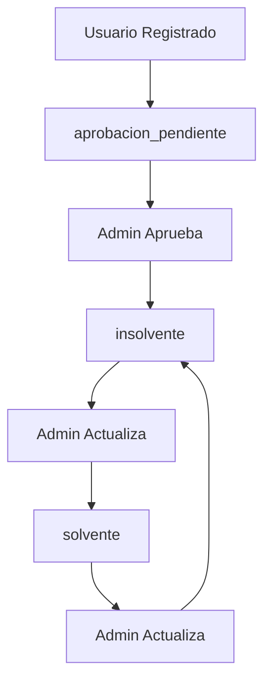

# Hoja de Ruta Frontend - Sistema de Registro e Incorporación de Usuarios

## Resumen Ejecutivo

Este documento proporciona una hoja de ruta completa para el equipo de frontend sobre cómo implementar los flujos de registro e incorporación de usuarios en el sistema de gestión de la Casa del Profesor Universitario. Se detallan los procesos para cada rol: **Estudiante**, **Profesor**, **Invitado** y **Administrador**.

## Arquitectura del Sistema

### Estados de Usuario
- **`aprobacion_pendiente`**: Usuario recién registrado, no puede iniciar sesión
- **`solvente`**: Usuario activo y al día con aportes
- **`insolvente`**: Usuario activo pero no al día con aportes

### Roles del Sistema
- **`usuario`**: Estado transitorio (no puede iniciar sesión)
- **`profesor`**: Docente de la UNET
- **`estudiante`**: Alumno de la UNET
- **`instructor`**: Experto externo que dirige academias
- **`obrero`**: Personal de mantenimiento
- **`invitado`**: Familiar o amigo de un profesor
- **`administrador`**: Control total del sistema

## Flujos de Registro e Incorporación

### 1. Flujo de Auto-Registro (Estudiantes y Profesores)

#### 1.1 Página de Registro Público
**Ruta**: `/register`
**Acceso**: Público (sin autenticación)

**Componentes Requeridos**:
- `RegistrationForm.vue`
- `RoleSelector.vue`
- `ProfessorResponsibleField.vue`
- `EmailValidation.vue`

**Campos del Formulario**:
```typescript
interface RegistrationData {
  name: string;
  email: string; // Debe terminar en @unet.edu.ve
  password: string;
  aspired_role: 'profesor' | 'estudiante';
  responsible_email?: string; // Requerido solo si aspired_role = 'estudiante'
}
```

**Validaciones Frontend**:
- Email debe terminar en `@unet.edu.ve`
- Si `aspired_role = 'estudiante'`, `responsible_email` es obligatorio
- `responsible_email` también debe terminar en `@unet.edu.ve`
- Contraseña mínimo 8 caracteres

**Flujo de UI**:
1. Usuario ingresa datos básicos (nombre, email, contraseña)
2. Selecciona rol aspirado (Profesor/Estudiante)
3. Si selecciona "Estudiante", aparece campo para email del profesor responsable
4. Validación en tiempo real de emails institucionales
5. Envío del formulario
6. Página de confirmación con mensaje de espera

**API Endpoint**:
```http
POST /api/v1/auth/register
Content-Type: application/json

{
  "name": "Juan Pérez",
  "email": "juan.perez@unet.edu.ve",
  "password": "password123",
  "aspired_role": "estudiante",
  "responsible_email": "maria.garcia@unet.edu.ve"
}
```

**Respuesta Esperada**:
```json
{
  "success": true,
  "data": {
    "user": { ... }
  },
  "message": "Usuario registrado exitosamente. Su cuenta está pendiente de aprobación administrativa."
}
```

**Nota**: No se retorna token de autenticación ya que el usuario no puede iniciar sesión hasta ser aprobado por un administrador.

#### 1.2 Página de Confirmación de Registro
**Ruta**: `/register/confirmation`
**Acceso**: Usuario recién registrado

**Contenido**:
- Mensaje de confirmación
- Explicación del proceso de aprobación
- Tiempo estimado de respuesta
- Información de contacto para consultas
- Opción de cerrar sesión

### 2. Flujo de Invitación (Invitados)

#### 2.1 Creación de Invitación
**Ruta**: `/invitations/create`
**Acceso**: Usuarios autenticados con rol `profesor` y status `solvente`

**Componentes Requeridos**:
- `InvitationForm.vue`
- `InvitationPreview.vue`

**Campos del Formulario**:
```typescript
interface InvitationData {
  name: string;
  email: string; // No requiere @unet.edu.ve
  message?: string;
}
```

**Flujo de UI**:
1. Profesor ingresa datos del invitado
2. Mensaje personalizado opcional
3. Preview de la invitación
4. Envío de la invitación
5. Confirmación de envío

**API Endpoint**:
```http
POST /api/v1/invitations
Authorization: Bearer {token}

{
  "name": "Ana García",
  "email": "ana.garcia@gmail.com",
  "message": "Te invito a participar en las actividades de la CPU"
}
```

#### 2.2 Gestión de Invitaciones (Profesor)
**Ruta**: `/invitations`
**Acceso**: Usuarios autenticados que han enviado invitaciones

**Funcionalidades**:
- Lista de invitaciones enviadas
- Estado de cada invitación (pendiente, aprobada, rechazada)
- Detalles de cada invitación
- Historial de cambios

### 3. Flujo de Administración

#### 3.1 Panel de Registros Pendientes
**Ruta**: `/admin/pending-registrations`
**Acceso**: Solo administradores

**Componentes Requeridos**:
- `PendingRegistrationsList.vue`
- `RegistrationDetails.vue`
- `ApprovalActions.vue`
- `UserStatusBadge.vue`

**Funcionalidades**:
- Lista paginada de usuarios pendientes
- Filtros por rol aspirado
- Búsqueda por nombre, email o profesor responsable
- Vista detallada de cada solicitud
- Acciones de aprobación/rechazo

**API Endpoint**:
```http
GET /api/v1/admin/pending-registrations?page=1&search=juan&aspired_role=estudiante
Authorization: Bearer {admin_token}
```

**Datos Mostrados**:
- Nombre y email del solicitante
- Rol aspirado
- Email del profesor responsable (si aplica)
- Fecha de solicitud
- Estado actual

#### 3.2 Proceso de Aprobación
**Flujo de UI**:
1. Admin revisa detalles de la solicitud
2. Verifica información del profesor responsable
3. Selecciona acción: Aprobar o Rechazar
4. Si aprueba: selecciona status inicial (`solvente` o `insolvente`)
5. Confirma la acción
6. Sistema actualiza estado automáticamente y envía notificaciones

**API Endpoint para Aprobar**:
```http
PUT /api/v1/users/{user_id}
Authorization: Bearer {admin_token}

{
  "status": "solvente"
}
```

**API Endpoint para Aprobar como Insolvente**:
```http
PUT /api/v1/users/{user_id}
Authorization: Bearer {admin_token}

{
  "status": "insolvente"
}
```

**API Endpoint para Rechazar**:
```http
DELETE /api/v1/users/{user_id}
Authorization: Bearer {admin_token}
```

**Comportamiento Automático del Sistema**:
- **Aprobación**: Cuando el admin cambia el status de `aprobacion_pendiente` a `solvente` o `insolvente`, el sistema automáticamente:
  - Promueve al usuario a su `aspired_role` (profesor/estudiante)
  - Limpia el campo `aspired_role` (ya no es necesario)
  - Envía notificación de aprobación al usuario
  - Registra auditoría completa de la acción
- **Rechazo**: Elimina el usuario del sistema

#### 3.3 Consulta de Usuarios por Estado
**Ruta**: `/admin/users`
**Acceso**: Solo administradores

**Funcionalidades**:
- Lista paginada de todos los usuarios
- Filtros por estado (`aprobacion_pendiente`, `solvente`, `insolvente`)
- Filtros por rol
- Búsqueda por nombre o email
- Vista detallada de cada usuario

**API Endpoints**:
```http
# Ver todos los usuarios con filtros
GET /api/v1/users?status=solvente&role=profesor&search=juan&page=1
Authorization: Bearer {admin_token}

# Ver usuarios pendientes específicamente
GET /api/v1/admin/pending-registrations?aspired_role=estudiante&search=maria
Authorization: Bearer {admin_token}

# Ver detalles de un usuario específico
GET /api/v1/users/{user_id}
Authorization: Bearer {admin_token}
```

#### 3.4 Panel de Invitaciones Pendientes
**Ruta**: `/admin/pending-invitations`
**Acceso**: Solo administradores

**Funcionalidades**:
- Lista de invitaciones pendientes
- Detalles del invitador e invitado
- Acciones de aprobación/rechazo
- Razón de rechazo (si aplica)

### 4. Flujo de Creación Directa por Administrador

#### 4.1 Creación de Usuarios
**Ruta**: `/admin/users/create`
**Acceso**: Solo administradores

**Componentes Requeridos**:
- `UserCreationForm.vue`
- `RoleSelector.vue`
- `StatusSelector.vue`

**Campos del Formulario**:
```typescript
interface AdminUserCreation {
  name: string;
  email: string;
  role: 'instructor' | 'obrero' | 'administrador';
  status: 'solvente' | 'insolvente';
  password?: string;
  solvent_until?: string;
}
```

**Flujo de UI**:
1. Admin selecciona tipo de usuario a crear
2. Ingresa datos básicos
3. Asigna rol y status directamente
4. Configura fecha de solvencia (opcional)
5. Crea la cuenta

## Estados y Transiciones de UI

### Estados de Usuario en la Interfaz

#### Usuario con Status `aprobacion_pendiente`
- **Acceso**: Solo puede ver página de confirmación
- **Restricciones**: No puede acceder a funcionalidades del sistema
- **UI**: Banner informativo sobre estado pendiente

#### Usuario con Status `insolvente`
- **Acceso**: Puede iniciar sesión y ver información
- **Restricciones**: No puede reservar ni invitar
- **UI**: Banner de advertencia sobre estado de solvencia

#### Usuario con Status `solvente`
- **Acceso**: Acceso completo según su rol
- **Funcionalidades**: Todas las funciones disponibles para su rol

### Transiciones de Estado



## Componentes de UI Requeridos

### Componentes Base
- `UserStatusBadge.vue` - Badge para mostrar estado del usuario
- `RoleBadge.vue` - Badge para mostrar rol del usuario
- `EmailValidator.vue` - Validador de emails institucionales
- `LoadingSpinner.vue` - Spinner para estados de carga
- `SuccessMessage.vue` - Mensajes de éxito
- `ErrorMessage.vue` - Mensajes de error

### Componentes de Formulario
- `RegistrationForm.vue` - Formulario de auto-registro
- `InvitationForm.vue` - Formulario de invitación
- `UserCreationForm.vue` - Formulario de creación por admin
- `ApprovalForm.vue` - Formulario de aprobación

### Componentes de Lista
- `PendingRegistrationsList.vue` - Lista de registros pendientes
- `PendingInvitationsList.vue` - Lista de invitaciones pendientes
- `UserList.vue` - Lista general de usuarios

### Componentes de Detalle
- `RegistrationDetails.vue` - Detalles de solicitud de registro
- `InvitationDetails.vue` - Detalles de invitación
- `UserProfile.vue` - Perfil de usuario

## Notificaciones en el Frontend

### Tipos de Notificación
- **`registration_pending`**: Nueva solicitud de registro
- **`user_approved`**: Usuario aprobado
- **`invitation_pending`**: Nueva invitación pendiente
- **`invitation_approved`**: Invitación aprobada
- **`invitation_rejected`**: Invitación rechazada

### Implementación de Notificaciones
```typescript
interface Notification {
  id: number;
  title: string;
  message: string;
  type: string;
  data?: any;
  read_at?: string;
  created_at: string;
}
```

**API Endpoints**:
```http
GET /api/v1/notifications - Listar notificaciones
GET /api/v1/notifications/unread - Notificaciones no leídas
GET /api/v1/notifications/count - Contador de no leídas
PUT /api/v1/notifications/{id}/read - Marcar como leída
PUT /api/v1/notifications/read-all - Marcar todas como leídas
```

## Validaciones y Errores

### Validaciones Frontend
- Emails institucionales (@unet.edu.ve)
- Campos requeridos según el rol
- Longitud mínima de contraseña
- Formato de fechas
- Unicidad de emails

### Manejo de Errores
- Mensajes de error específicos por campo
- Validación en tiempo real
- Feedback visual inmediato
- Mensajes de error del servidor

## Consideraciones de UX/UI

### Diseño Responsivo
- Mobile-first approach
- Adaptación a tablets y desktop
- Navegación intuitiva

### Accesibilidad
- Contraste adecuado
- Navegación por teclado
- Screen reader friendly
- Labels descriptivos

### Performance
- Lazy loading de componentes
- Paginación en listas
- Debounce en búsquedas
- Caching de datos

## Testing

### Tests Unitarios
- Validación de formularios
- Lógica de componentes
- Utilidades de validación

### Tests de Integración
- Flujos completos de registro
- Procesos de aprobación
- Notificaciones

### Tests E2E
- Flujo de auto-registro completo
- Proceso de invitación
- Panel de administración

## Cronograma de Implementación

### Fase 1: Componentes Base (Semana 1-2)
- [ ] Componentes de UI base
- [ ] Sistema de validaciones
- [ ] Manejo de errores
- [ ] Configuración de routing

### Fase 2: Auto-Registro (Semana 3-4)
- [ ] Formulario de registro
- [ ] Página de confirmación
- [ ] Validaciones específicas
- [ ] Integración con API

### Fase 3: Sistema de Invitaciones (Semana 5-6)
- [ ] Formulario de invitación
- [ ] Gestión de invitaciones
- [ ] Panel de invitaciones pendientes
- [ ] Proceso de aprobación

### Fase 4: Panel de Administración (Semana 7-8)
- [ ] Lista de registros pendientes
- [ ] Proceso de aprobación
- [ ] Creación directa de usuarios
- [ ] Gestión de usuarios

### Fase 5: Notificaciones y Pulimiento (Semana 9-10)
- [ ] Sistema de notificaciones
- [ ] Mejoras de UX
- [ ] Testing completo
- [ ] Optimizaciones

## Consideraciones Técnicas

### Estado Global
- Vuex/Pinia para manejo de estado
- Persistencia de datos de usuario
- Cache de notificaciones

### Seguridad
- Validación de tokens
- Sanitización de inputs
- Protección CSRF
- Rate limiting

### Internacionalización
- Soporte para múltiples idiomas
- Formateo de fechas y números
- Mensajes localizados

## Conclusión

Esta hoja de ruta proporciona una guía completa para implementar el sistema de registro e incorporación de usuarios. El enfoque modular y la separación clara de responsabilidades facilitarán el desarrollo y mantenimiento del sistema.

Cada fase está diseñada para ser independiente, permitiendo desarrollo paralelo y testing incremental. La documentación detallada de APIs y componentes asegura una implementación consistente y de alta calidad.
