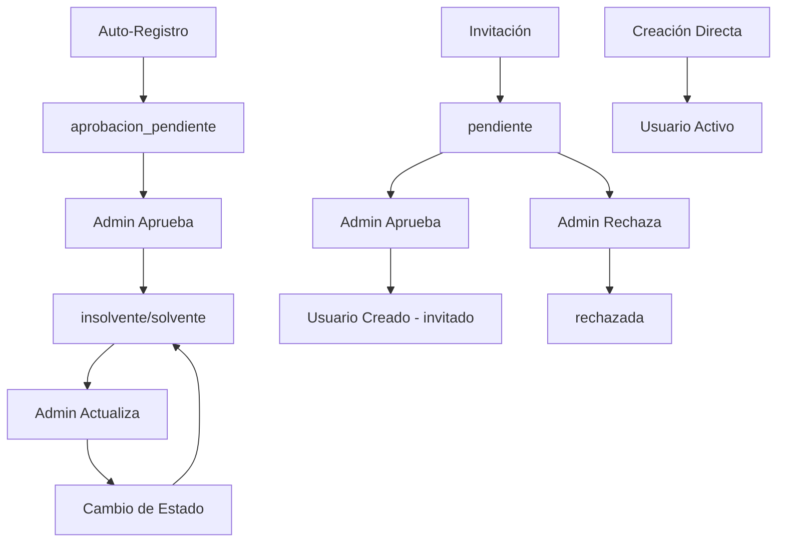

# Sistema de Registro de Usuarios e Invitaciones - CPU UNET

## Resumen Ejecutivo

Este documento describe la implementación completa del sistema de registro de usuarios e invitaciones para la Casa del Profesor Universitario (CPU) de la UNET. El sistema maneja tres flujos principales de creación de usuarios: auto-registro, invitaciones y creación directa por administradores.

## Arquitectura del Sistema

### Estados de Usuario

El sistema utiliza un campo `status` para controlar el acceso y funcionalidades de los usuarios:

- **`aprobacion_pendiente`**: Estado inicial para usuarios auto-registrados. No pueden iniciar sesión.
- **`solvente`**: Usuario activo y al día con aportes. Acceso completo según su rol.
- **`insolvente`**: Usuario activo pero no al día con aportes. Acceso limitado.

### Roles del Sistema

| Rol | Descripción | Vía de Creación | Permisos |
|-----|-------------|-----------------|----------|
| `usuario` | Estado transitorio | Auto-registro | No puede iniciar sesión |
| `profesor` | Docente UNET | Auto-registro + aprobación | Puede invitar, reservar |
| `estudiante` | Alumno UNET | Auto-registro + aprobación | Puede reservar |
| `instructor` | Experto externo | Creación directa por admin | Gestiona su academia |
| `obrero` | Personal mantenimiento | Creación directa por admin | Acceso operativo limitado |
| `invitado` | Familiar/amigo profesor | Invitación + aprobación | Acceso temporal limitado |
| `administrador` | Control total | Asignación manual | Todas las funciones |

## Estructura de Base de Datos

### Tabla `users`

```sql
CREATE TABLE users (
    id BIGINT PRIMARY KEY,
    role ENUM('usuario', 'profesor', 'estudiante', 'instructor', 'obrero', 'invitado', 'administrador'),
    status ENUM('aprobacion_pendiente', 'solvente', 'insolvente') DEFAULT 'aprobacion_pendiente',
    responsible_email VARCHAR(180) NULL, -- Email del profesor responsable (para estudiantes)
    aspired_role ENUM('profesor', 'estudiante') NULL, -- Rol aspirado en auto-registro
    name VARCHAR(255),
    email VARCHAR(255) UNIQUE,
    password VARCHAR(255),
    sso_uid VARCHAR(255) NULL,
    solvent_until DATE NULL,
    created_at TIMESTAMP,
    updated_at TIMESTAMP,
    deleted_at TIMESTAMP NULL
);
```

### Tabla `invitations`

```sql
CREATE TABLE invitations (
    id BIGINT PRIMARY KEY,
    inviter_user_id BIGINT, -- Usuario que envía la invitación
    name VARCHAR(255), -- Nombre del invitado
    email VARCHAR(255), -- Email del invitado
    message TEXT NULL, -- Mensaje personalizado
    token VARCHAR(64), -- Token único para la invitación
    status ENUM('pendiente', 'aceptada', 'rechazada', 'expirada', 'revocada') DEFAULT 'pendiente',
    expires_at TIMESTAMP, -- Fecha de expiración (30 días)
    reviewed_by BIGINT NULL, -- Admin que revisó la invitación
    reviewed_at TIMESTAMP NULL,
    rejection_reason TEXT NULL,
    created_at TIMESTAMP,
    updated_at TIMESTAMP
);
```

## Flujos de Registro

### 1. Auto-Registro (Estudiantes y Profesores)

#### 1.1 Proceso de Registro

**Endpoint**: `POST /api/v1/auth/register`

**Validaciones**:
- Email debe terminar en `@unet.edu.ve`
- Si `aspired_role = 'estudiante'`, `responsible_email` es obligatorio
- `responsible_email` también debe terminar en `@unet.edu.ve`
- Contraseña mínimo 8 caracteres

**Payload**:
```json
{
  "name": "Juan Pérez",
  "email": "juan.perez@unet.edu.ve",
  "password": "password123",
  "aspired_role": "estudiante",
  "responsible_email": "maria.garcia@unet.edu.ve"
}
```

**Resultado**:
- Se crea usuario con `role: 'usuario'` y `status: 'aprobacion_pendiente'`
- Se guarda el `aspired_role` y `responsible_email`
- Se notifica a todos los administradores
- **No se retorna token** (usuario no puede iniciar sesión)

#### 1.2 Aprobación Administrativa

**Endpoint**: `PUT /api/v1/users/{user_id}`

**Proceso**:
1. Admin revisa la solicitud en `/admin/pending-registrations`
2. Cambia el `status` a `solvente` o `insolvente`
3. El sistema automáticamente:
   - Promueve al usuario a su `aspired_role`
   - Limpia el campo `aspired_role`
   - Envía notificación de aprobación
   - Registra auditoría completa

**Payload para Aprobar**:
```json
{
  "status": "solvente"
}
```

### 2. Sistema de Invitaciones

#### 2.1 Creación de Invitación

**Endpoint**: `POST /api/v1/invitations`

**Requisitos**:
- Usuario autenticado con rol `profesor` y status `solvente`
- Email del invitado no debe existir en el sistema
- No debe haber invitación pendiente para ese email

**Payload**:
```json
{
  "name": "Ana García",
  "email": "ana.garcia@gmail.com",
  "message": "Te invito a participar en las actividades de la CPU"
}
```

**Proceso**:
1. Se crea invitación con `status: 'pendiente'`
2. Se genera token único de 64 caracteres
3. Se establece expiración a 30 días
4. Se notifica a todos los administradores
5. Se registra auditoría

#### 2.2 Aprobación de Invitación

**Endpoint**: `PUT /api/v1/invitations/{id}/approve`

**Proceso**:
1. Admin revisa la invitación
2. Al aprobar, se crea usuario con:
   - `role: 'invitado'`
   - `status: 'solvente'` (por defecto)
   - `responsible_email`: email del profesor que invitó
3. Se actualiza invitación a `status: 'aceptada'`
4. Se notifica al invitado y al profesor

#### 2.3 Rechazo de Invitación

**Endpoint**: `PUT /api/v1/invitations/{id}/reject`

**Payload**:
```json
{
  "rejection_reason": "No cumple con los requisitos institucionales"
}
```

### 3. Creación Directa por Administrador

**Endpoint**: `POST /api/v1/users`

**Payload**:
```json
{
  "name": "Carlos López",
  "email": "carlos.lopez@unet.edu.ve",
  "role": "instructor",
  "status": "solvente",
  "password": "password123",
  "solvent_until": "2024-12-31"
}
```

**Uso**: Para crear instructores, obreros y otros roles especiales.

## API Endpoints Completos

### Autenticación y Registro

```http
POST /api/v1/auth/register
POST /api/v1/login
POST /api/v1/logout
```

### Gestión de Usuarios

```http
# Público
GET /api/v1/users
GET /api/v1/users/{user}

# Admin
POST /api/v1/users
PUT /api/v1/users/{user}
DELETE /api/v1/users/{user}
GET /api/v1/admin/pending-registrations
```

### Sistema de Invitaciones

```http
# Usuarios autenticados
POST /api/v1/invitations

# Admin
GET /api/v1/invitations
GET /api/v1/invitations/pending
PUT /api/v1/invitations/{id}/approve
PUT /api/v1/invitations/{id}/reject
```

### Notificaciones

```http
GET /api/v1/notifications
GET /api/v1/notifications/unread
GET /api/v1/notifications/count
PUT /api/v1/notifications/{id}/read
PUT /api/v1/notifications/read-all
```

## Servicios y Lógica de Negocio

### UserService

**Métodos principales**:
- `register(array $data)`: Procesa auto-registro
- `createUser(array $data, int $adminUserId)`: Creación directa por admin
- `updateUserStatus(int $userId, string $status, int $adminUserId)`: Cambio de estado
- `promoteToRole(string $email, string $role)`: Promoción de rol

### InvitationService

**Métodos principales**:
- `createInvitation(array $data, int $inviterUserId)`: Crear invitación
- `approveInvitation(int $invitationId, int $adminUserId)`: Aprobar invitación
- `rejectInvitation(int $invitationId, string $reason, int $adminUserId)`: Rechazar invitación

### NotificationService

**Funcionalidades**:
- Notificar admins sobre nuevos registros pendientes
- Notificar admins sobre nuevas invitaciones
- Notificar usuarios sobre aprobaciones/rechazos
- Sistema de notificaciones en tiempo real

## Validaciones y Reglas de Negocio

### Validaciones de Auto-Registro

1. **Email Institucional**: Debe terminar en `@unet.edu.ve`
2. **Profesor Responsable**: Obligatorio para estudiantes
3. **Unicidad**: Email único en el sistema
4. **Rol Aspirado**: Solo `profesor` o `estudiante`

### Validaciones de Invitaciones

1. **Permisos**: Solo profesores solventes pueden invitar
2. **Email Único**: No puede existir usuario o invitación pendiente
3. **Expiración**: Invitaciones expiran en 30 días
4. **Estado**: Solo invitaciones pendientes pueden ser procesadas

### Reglas de Estado

1. **Transición de Estado**: Solo admins pueden cambiar estados
2. **Promoción Automática**: Al aprobar auto-registro, se promueve al rol aspirado
3. **Auditoría**: Todas las acciones se registran en `audit_logs`
4. **Notificaciones**: Cambios de estado generan notificaciones automáticas

## Flujo de Estados



## Consideraciones de Seguridad

### Autenticación

- **SSO/LDAP**: Para docentes y personal UNET
- **Laravel Sanctum**: Como fallback y para tokens SPA
- **Tokens**: Expiración automática y renovación

### Autorización

- **Middleware**: `auth:sanctum` para rutas protegidas
- **Middleware**: `admin` para funciones administrativas
- **Policies**: Control granular de permisos por rol

### Validación

- **Form Requests**: Validación centralizada de datos
- **Sanitización**: Limpieza de inputs maliciosos
- **Rate Limiting**: Protección contra ataques de fuerza bruta

## Notificaciones del Sistema

### Tipos de Notificación

- `registration_pending`: Nueva solicitud de registro
- `user_approved`: Usuario aprobado
- `user_rejected`: Usuario rechazado
- `invitation_pending`: Nueva invitación pendiente
- `invitation_approved`: Invitación aprobada
- `invitation_rejected`: Invitación rechazada

### Implementación

- **Base de Datos**: Tabla `notifications` con relación a usuarios
- **Tiempo Real**: WebSockets para notificaciones instantáneas
- **Email**: Notificaciones por correo electrónico (futuro)
- **In-App**: Sistema de notificaciones en la interfaz

## Auditoría y Logging

### AuditLog

Todas las acciones sensibles se registran en la tabla `audit_logs`:

```sql
CREATE TABLE audit_logs (
    id BIGINT PRIMARY KEY,
    user_id BIGINT, -- Usuario que realizó la acción
    target_user_id BIGINT NULL, -- Usuario afectado
    action VARCHAR(100), -- Tipo de acción
    old_data JSON NULL, -- Estado anterior
    new_data JSON NULL, -- Estado nuevo
    ip_address VARCHAR(45),
    user_agent TEXT,
    created_at TIMESTAMP
);
```

### Acciones Auditadas

- Creación de usuarios
- Cambios de estado
- Aprobaciones/rechazos
- Creación de invitaciones
- Modificaciones de roles

## Testing

### Tests Unitarios

- Validación de servicios
- Lógica de negocio
- Manejo de errores

### Tests de Integración

- Flujos completos de registro
- Procesos de invitación
- Cambios de estado

### Tests E2E

- Flujo de auto-registro completo
- Proceso de invitación end-to-end
- Panel de administración

## Consideraciones de Performance

### Optimizaciones

- **Eager Loading**: Carga de relaciones para evitar N+1
- **Índices**: Índices en campos de búsqueda frecuente
- **Cache**: Cache de consultas frecuentes
- **Paginación**: Listas paginadas para grandes volúmenes

### Monitoreo

- **Logs**: Registro de operaciones críticas
- **Métricas**: Tiempo de respuesta de endpoints
- **Alertas**: Notificaciones de errores críticos

## Roadmap y Mejoras Futuras

### Fase 1: Completar Implementación
- [ ] Sistema de emails para notificaciones
- [ ] WebSockets para notificaciones en tiempo real
- [ ] Panel de administración completo

### Fase 2: Mejoras de UX
- [ ] Proceso de registro simplificado
- [ ] Dashboard de invitaciones
- [ ] Historial de acciones

### Fase 3: Integración Avanzada
- [ ] Integración completa con SSO/LDAP
- [ ] API de terceros
- [ ] Reportes y analytics

## Conclusión

El sistema de registro e invitaciones de la CPU UNET está diseñado para ser robusto, seguro y escalable. La separación clara de responsabilidades, el uso de transacciones de base de datos y el sistema de auditoría garantizan la integridad de los datos y la trazabilidad de todas las operaciones.

La arquitectura modular permite futuras extensiones y mejoras sin afectar la funcionalidad existente, mientras que las validaciones estrictas y el sistema de permisos aseguran que solo usuarios autorizados puedan realizar acciones sensibles.
